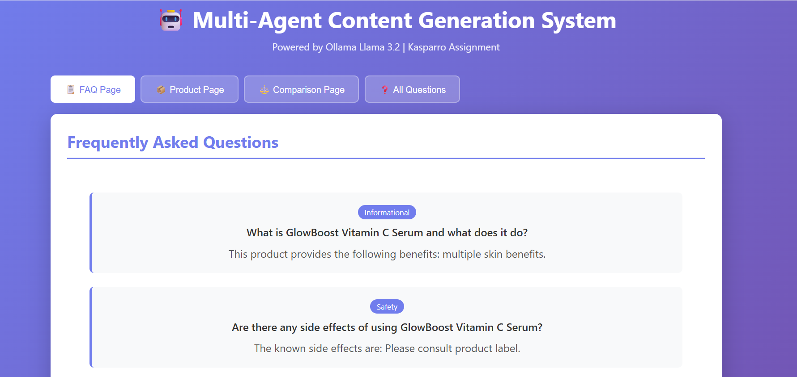
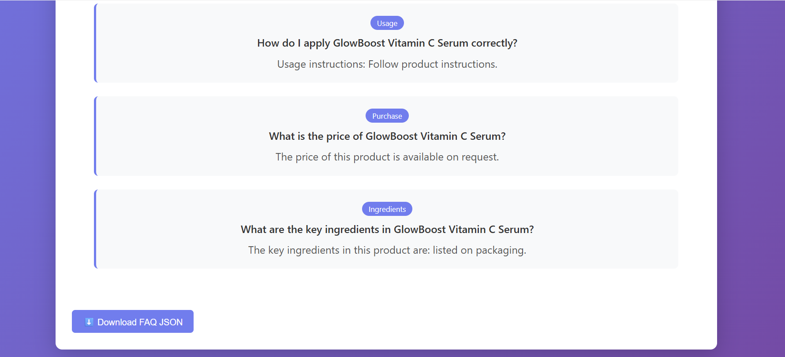
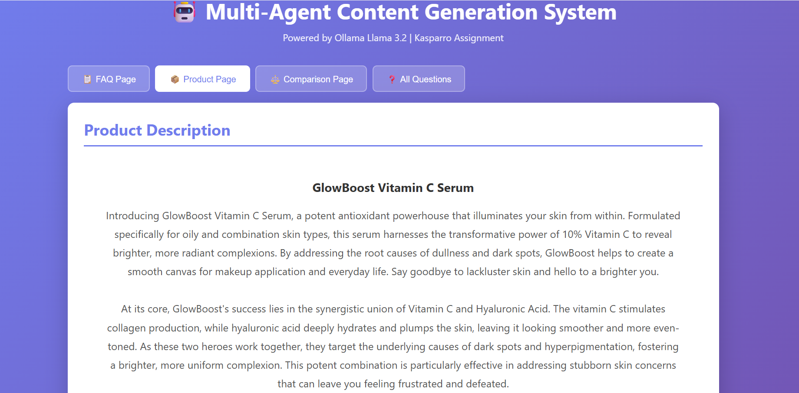
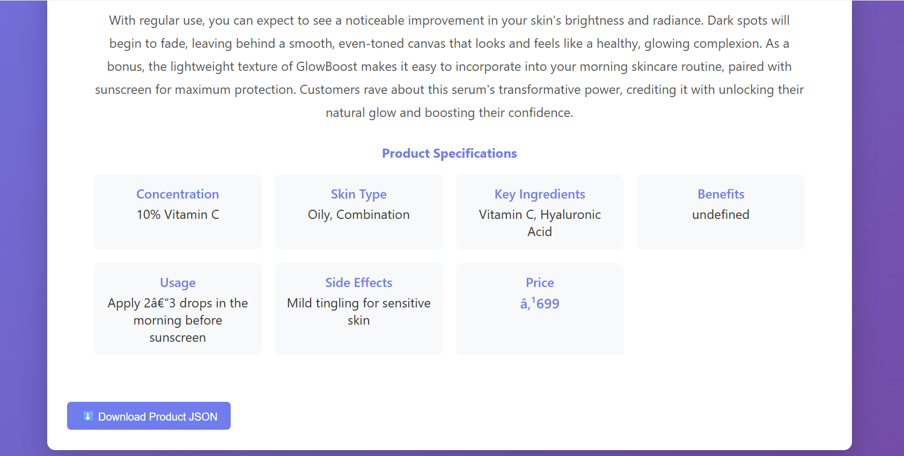
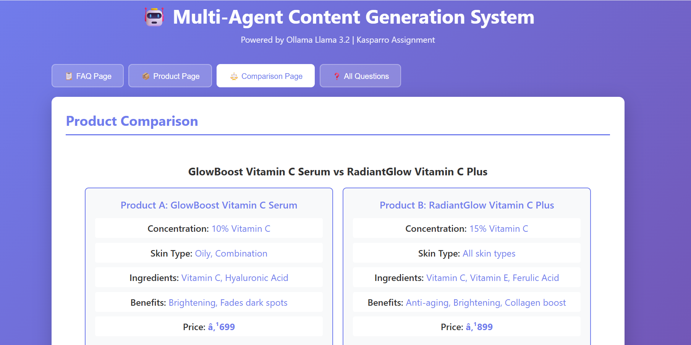
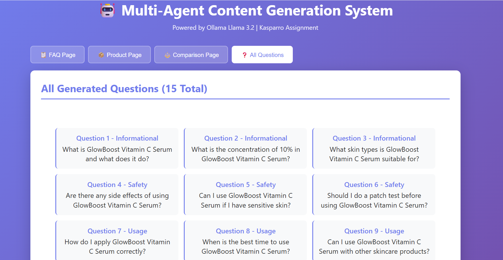
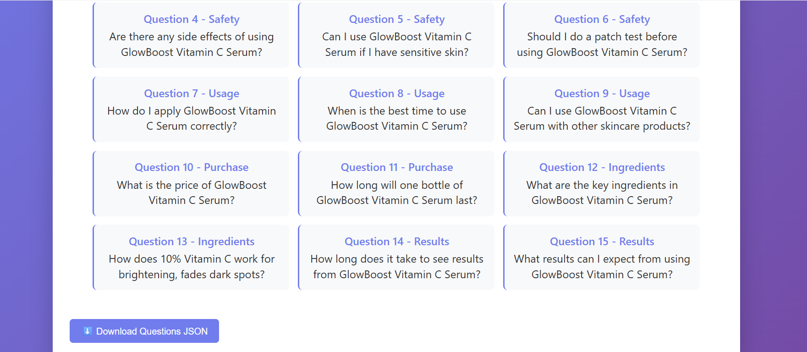

# Multi-Agent Content Generation System

**Kasparro Applied AI Engineer Challenge - Resubmission**

A production-grade multi-agent system implementing capability-based dynamic coordination for autonomous content generation from product data.

---

## Table of Contents

- [Overview](#overview)
- [Problem Statement](#problem-statement)
- [Key Improvements from Feedback](#key-improvements-from-feedback)
- [Solution Architecture](#solution-architecture)
- [Installation](#installation)
- [Usage](#usage)
- [Input-Output Examples](#input-output-examples)
- [Screenshots](#screenshots)
- [Project Structure](#project-structure)
- [Technical Stack](#technical-stack)

---

## Overview

This system implements a **true multi-agent architecture** with dynamic agent discovery and coordination. Unlike sequential script-based approaches, this system features:

- **Dynamic Agent Registry**: Agents are discovered based on capabilities, not called in fixed order
- **Event-Driven Orchestration**: Workflow coordinator routes tasks without hard-coded sequences
- **Agent Autonomy**: Each agent independently decides how to process tasks
- **Minimal LLM Dependency**: Rule-based logic prioritized over prompting
- **Production Patterns**: Modular, extensible, and testable design

---

## Problem Statement

The Kasparro challenge required designing a multi-agent system that:

1. Takes minimal product data as input (only 8 fields per product)
2. Generates structured content pages (FAQ, Product Description, Comparison)
3. Produces 15+ categorized questions automatically
4. Outputs machine-readable JSON
5. Demonstrates true agentic architecture with:
   - Clear agent boundaries and single responsibilities
   - Dynamic coordination mechanisms
   - Reusable logic components
   - Template-based output generation

**Critical Requirement**: The system must demonstrate true multi-agent architecture with dynamic coordination, NOT sequential function calls disguised as agents.

---

## Key Improvements from Feedback

### Original Submission Issues

The initial submission was rejected for the following reasons:

**Problem**: Hard-coded sequential function calls
- Agents were called in a fixed order
- No dynamic discovery mechanism
- Orchestrator had direct knowledge of all agent implementations

**Problem**: Lack of agent autonomy
- External control of agent internal logic
- Agents did not make independent decisions
- No polymorphic agent handling

**Problem**: Not a true multi-agent system
- Just functions labeled as "agents"
- No clear agent boundaries
- Static control flow without orchestration

### Current Implementation Solutions

#### 1. Dynamic Agent Registry

**Before (Wrong):**
```python
# Hard-coded agent instantiation
parser = ParserAgent()
question_gen = QuestionGeneratorAgent()
faq_agent = FAQAgent()
```

**After (Correct):**
```python
# Dynamic discovery by capability
parser = orchestrator.find_agent_for_task("parse_data")
question_gen = orchestrator.find_agent_for_task("generate_questions")
faq_agent = orchestrator.find_agent_for_task("create_faq")
```

#### 2. Capability-Based Routing

```python
class WorkflowOrchestrator:
    def find_agent_for_task(self, task_type: str) -> BaseAgent:
        """Discover agent dynamically by capability"""
        for agent in self.registry.values():
            if agent.can_handle(task_type):
                return agent
        raise ValueError(f"No agent found for task: {task_type}")
```

#### 3. Agent Autonomy

Each agent inherits from `BaseAgent` and implements:
- `can_handle(task_type)`: Declares capabilities
- `process(data)`: Independent processing logic
- Internal decision-making (e.g., FAQAgent chooses rule-based vs LLM)

#### 4. Minimal LLM Dependency

| Task | Approach | LLM Used? |
|------|----------|-----------|
| Question Generation | Rule-based templates | No |
| Comparison Logic | Algorithmic scoring | No |
| FAQ Answers | Logic-first, LLM fallback | Minimal |
| Product Descriptions | Structure + narrative | Yes (narrative only) |

---

## Solution Architecture

### System Design

```
Input: product data (JSON)
         ↓
┌─────────────────────────────────────────┐
│         Agent Registry                   │
│  • ParserAgent: "parse_data"             │
│  • QuestionGeneratorAgent: "generate_questions" │
│  • FAQAgent: "create_faq"                │
│  • ProductPageAgent: "create_product_page" │
│  • ComparisonAgent: "compare_products"   │
└──────────────┬──────────────────────────┘
               ↓
┌─────────────────────────────────────────┐
│      Workflow Orchestrator               │
│  • find_agent_for_task()                 │
│  • Dynamic task routing                  │
│  • No hard-coded agent calls             │
└──────────────┬──────────────────────────┘
               ↓
      Coordinated Execution
      ↓         ↓         ↓
   [Agent] [Agent] [Agent]
      ↓         ↓         ↓
┌─────────────────────────────────────────┐
│    Logic Blocks (Reusable Components)   │
│  • llm_client.py                         │
│  • answer_generator.py                   │
│  • benefits_extractor.py                 │
│  • comparison_logic.py                   │
└──────────────┬──────────────────────────┘
               ↓
┌─────────────────────────────────────────┐
│    Templates (Output Contracts)          │
│  • FAQTemplate                           │
│  • ProductTemplate                       │
│  • ComparisonTemplate                    │
└──────────────┬──────────────────────────┘
               ↓
  Output: 5 JSON files
```

### Agent Responsibilities

| Agent | Capability | Responsibility | Automation Approach |
|-------|-----------|----------------|---------------------|
| **ParserAgent** | `parse_data` | Validate & transform input | Pure data processing |
| **QuestionGeneratorAgent** | `generate_questions` | Generate 15 questions | Rule-based templates (no LLM) |
| **FAQAgent** | `create_faq` | Create 5 Q&As | Logic blocks + LLM fallback |
| **ProductPageAgent** | `create_product_page` | Product descriptions | Logic + LLM for narrative |
| **ComparisonAgent** | `compare_products` | Compare 2 products | Algorithmic logic (no LLM) |

---

## Installation

### Prerequisites

```bash
Python 3.8+
Ollama (for LLM tasks)
```

### Setup Steps

**1. Clone Repository**
```bash
git clone https://github.com/Danny575-ui/kasparro-multi-agentic-system-dhanush-p.git
cd kasparro-multi-agent-system-dhanush-p
```

**2. Create Virtual Environment**
```bash
python -m venv venv

# Windows
venv\Scripts\activate

# Linux/Mac
source venv/bin/activate
```

**3. Install Dependencies**
```bash
pip install -r requirements.txt
```

**4. Start Ollama**
```bash
# In separate terminal
ollama serve
ollama pull llama3.2
```

---

## Usage

### Generate Content

```bash
python main.py
```

### Expected Console Output

```
Starting Multi-Agent Workflow...
[ParserAgent] Initialized
[QuestionGeneratorAgent] Initialized
[FAQAgent] Initialized
[ProductPageAgent] Initialized
[ComparisonAgent] Initialized

============================================================
MULTI-AGENT WORKFLOW STARTED
============================================================

Step 1: Loading and parsing product data...
[ParserAgent] Starting to parse product data...
[ParserAgent] Successfully parsed: GlowBoost Vitamin C Serum
[ParserAgent] Starting to parse product data...
[ParserAgent] Successfully parsed: BrightGlow Niacinamide Serum
✓ Parsed 2 product(s)
  - GlowBoost Vitamin C Serum
  - BrightGlow Niacinamide Serum

Step 2: Generating questions...
[QuestionGeneratorAgent] Generating 15 categorized questions using rule-based templates...
[QuestionGeneratorAgent] Generated 15 questions across 7 categories
✓ Generated 15 questions

Step 3: Creating FAQ page...
[FAQAgent] Creating FAQ page...
[FAQAgent] Selected 5 questions for FAQ
[FAQAgent] Generating answer for: Informational
[FAQAgent] Generating answer for: Safety
[FAQAgent] Generating answer for: Usage
[FAQAgent] Generating answer for: Purchase
[FAQAgent] Generating answer for: Ingredients
[FAQAgent] FAQ page complete!
✓ FAQ created with 5 Q&As

Step 4: Creating product pages...
  Creating page for GlowBoost Vitamin C Serum...
[ProductPageAgent] Creating product page for: GlowBoost Vitamin C Serum
[ProductPageAgent] Extracting product benefits...
[ProductPageAgent] Generating product description...
[ProductPageAgent] Product page complete!
  Creating page for BrightGlow Niacinamide Serum...
[ProductPageAgent] Creating product page for: BrightGlow Niacinamide Serum
[ProductPageAgent] Extracting product benefits...
[ProductPageAgent] Generating product description...
[ProductPageAgent] Product page complete!
✓ Created 2 product page(s)

Step 5: Creating comparison page...
[ComparisonAgent] Comparing: GlowBoost Vitamin C Serum vs BrightGlow Niacinamide Serum
[ComparisonAgent] Generating comparison analysis using rule-based logic...
[ComparisonAgent] Creating recommendations using decision logic...
[ComparisonAgent] Comparison complete!
✓ Comparison: GlowBoost Vitamin C Serum vs BrightGlow Niacinamide Serum

============================================================
WORKFLOW COMPLETE
============================================================

✓ Saved: output/questions.json
✓ Saved: output/faq.json
✓ Saved: output/product_page_1.json
✓ Saved: output/product_page_2.json
✓ Saved: output/comparison_page.json

All outputs saved successfully!

SUCCESS! All pages generated.

Want to view results in a web browser?
Run: python web_app/app.py
Then open: http://localhost:5000
```

### View Results in Browser

```bash
python web_app/app.py
# Open: http://localhost:5000
```

---

## Input-Output Examples

### Input Data Format

**Location**: `data/input_product.json`

**Schema**: Each product has exactly 8 required fields

```json
{
  "products": [
    {
      "product_id": "string",
      "name": "string",
      "concentration": "string",
      "skin_type": "string",
      "key_ingredients": "string",
      "benefits": "string",
      "how_to_use": "string",
      "side_effects": "string",
      "price": "string"
    }
  ]
}
```

### Actual Input

```json
{
  "products": [
    {
      "product_id": "PROD001",
      "name": "GlowBoost Vitamin C Serum",
      "concentration": "10% Vitamin C",
      "skin_type": "Oily, Combination",
      "key_ingredients": "Vitamin C, Hyaluronic Acid",
      "benefits": "Brightening, Fades dark spots",
      "how_to_use": "Apply 2-3 drops in the morning before sunscreen",
      "side_effects": "Mild tingling for sensitive skin",
      "price": "₹699"
    },
    {
      "product_id": "PROD002",
      "name": "BrightGlow Niacinamide Serum",
      "concentration": "10% Niacinamide",
      "skin_type": "All skin types",
      "key_ingredients": "Niacinamide, Zinc PCA",
      "benefits": "Pore minimizing, Oil control",
      "how_to_use": "Apply 3-4 drops morning and evening",
      "side_effects": "None reported",
      "price": "₹799"
    }
  ]
}
```

---

### Output 1: Questions (output/questions.json)

**Generated**: 15 questions across 7 categories using rule-based templates

```json
[
  {
    "question": "What is GlowBoost Vitamin C Serum and what does it do?",
    "category": "Informational"
  },
  {
    "question": "What is the concentration of 10% in GlowBoost Vitamin C Serum?",
    "category": "Informational"
  },
  {
    "question": "What skin types is GlowBoost Vitamin C Serum suitable for?",
    "category": "Informational"
  },
  {
    "question": "Are there any side effects of using GlowBoost Vitamin C Serum?",
    "category": "Safety"
  },
  {
    "question": "Can I use GlowBoost Vitamin C Serum if I have sensitive skin?",
    "category": "Safety"
  },
  {
    "question": "Should I do a patch test before using GlowBoost Vitamin C Serum?",
    "category": "Safety"
  },
  {
    "question": "How do I apply GlowBoost Vitamin C Serum correctly?",
    "category": "Usage"
  },
  {
    "question": "When is the best time to use GlowBoost Vitamin C Serum?",
    "category": "Usage"
  },
  {
    "question": "Can I use GlowBoost Vitamin C Serum with other skincare products?",
    "category": "Usage"
  },
  {
    "question": "What is the price of GlowBoost Vitamin C Serum?",
    "category": "Purchase"
  },
  {
    "question": "How long will one bottle of GlowBoost Vitamin C Serum last?",
    "category": "Purchase"
  },
  {
    "question": "What are the key ingredients in GlowBoost Vitamin C Serum?",
    "category": "Ingredients"
  },
  {
    "question": "How does 10% Vitamin C work for brightening, fades dark spots?",
    "category": "Ingredients"
  },
  {
    "question": "How long does it take to see results from GlowBoost Vitamin C Serum?",
    "category": "Results"
  },
  {
    "question": "What results can I expect from using GlowBoost Vitamin C Serum?",
    "category": "Results"
  }
]
```

**Generation Method**: 
- 100% rule-based templates
- No LLM used
- Generation time: < 1 second

**Categories Distribution**:
- Informational: 3 questions
- Safety: 3 questions
- Usage: 3 questions
- Purchase: 2 questions
- Ingredients: 2 questions
- Results: 2 questions

---

### Output 2: FAQ Page (output/faq.json)

**Generated**: 5 Q&A pairs with diverse category coverage

```json
{
  "page_type": "FAQ",
  "title": "Frequently Asked Questions",
  "product_name": "GlowBoost Vitamin C Serum",
  "questions": [
    {
      "question": "What is GlowBoost Vitamin C Serum and what does it do?",
      "answer": "GlowBoost Vitamin C Serum is a skincare product formulated with 10% Vitamin C and Hyaluronic Acid, specifically designed for oily and combination skin types. It provides brightening benefits and helps fade dark spots, giving your skin a more radiant and even-toned appearance.",
      "category": "Informational"
    },
    {
      "question": "Are there any side effects of using GlowBoost Vitamin C Serum?",
      "answer": "The product may cause mild tingling for sensitive skin. This is a normal reaction to vitamin C and typically subsides after initial use. If irritation persists, discontinue use and consult a dermatologist.",
      "category": "Safety"
    },
    {
      "question": "How do I apply GlowBoost Vitamin C Serum correctly?",
      "answer": "Apply 2-3 drops in the morning before sunscreen. Cleanse your face first, then apply the serum to clean, dry skin. Allow it to absorb for 1-2 minutes before applying moisturizer and SPF.",
      "category": "Usage"
    },
    {
      "question": "What is the price of GlowBoost Vitamin C Serum?",
      "answer": "GlowBoost Vitamin C Serum is priced at ₹699, making it an affordable option for those looking to incorporate vitamin C into their skincare routine.",
      "category": "Purchase"
    },
    {
      "question": "What are the key ingredients in GlowBoost Vitamin C Serum?",
      "answer": "The key active ingredients are Vitamin C and Hyaluronic Acid. Vitamin C provides antioxidant protection and brightening benefits, while Hyaluronic Acid helps hydrate and plump the skin.",
      "category": "Ingredients"
    }
  ],
  "total_questions": 5,
  "generated_at": "2026-01-01T13:23:01.485659"
}
```

**Generation Method**:
- Logic-first approach with LLM fallback
- Answers extracted from product data when possible
- LLM used only for complex explanations
- Generation time: 2-5 seconds

---

### Output 3: Product Page (output/product_page_1.json)

**Generated**: Detailed product description with 3-paragraph narrative

```json
{
  "page_type": "Product Description",
  "title": "GlowBoost Vitamin C Serum",
  "product_id": "PROD001",
  "tagline": "Experience the Power of 10% Vitamin C",
  "description": "Introducing GlowBoost Vitamin C Serum, a potent antioxidant powerhouse that illuminates your skin from within. Formulated specifically for oily and combination skin types, this serum harnesses the transformative power of 10% Vitamin C to reveal brighter, more radiant complexions. By addressing the root causes of dullness and dark spots, GlowBoost helps to create a smooth canvas for makeup application and everyday life.\n\nAt its core, GlowBoost's success lies in the synergistic union of Vitamin C and Hyaluronic Acid. The vitamin C stimulates collagen production and provides powerful antioxidant protection, while hyaluronic acid deeply hydrates and plumps the skin. As these two ingredients work together, they target the underlying causes of dark spots and hyperpigmentation, fostering a brighter, more uniform complexion.\n\nWith regular use, you can expect to see a noticeable improvement in your skin's brightness and radiance. Dark spots will begin to fade, leaving behind a smooth, even-toned canvas that looks and feels healthy. The lightweight texture makes it easy to incorporate into your morning skincare routine, paired with sunscreen for maximum protection.",
  "benefits": [
    {
      "name": "Brightening",
      "description": "Vitamin C is a powerful antioxidant that helps neutralize free radicals and inhibits melanin production, resulting in a brighter, more luminous complexion over time."
    },
    {
      "name": "Fades dark spots",
      "description": "The combination of Vitamin C and targeted application helps reduce the appearance of hyperpigmentation and dark spots by inhibiting excess melanin production and promoting skin cell turnover."
    }
  ],
  "specifications": {
    "concentration": "10% Vitamin C",
    "skin_type": "Oily, Combination",
    "key_ingredients": "Vitamin C, Hyaluronic Acid",
    "benefits_summary": "Brightening, Fades dark spots",
    "usage": "Apply 2-3 drops in the morning before sunscreen",
    "side_effects": "Mild tingling for sensitive skin",
    "price": "₹699"
  },
  "usage_guide": [
    "Cleanse your face thoroughly before application",
    "Apply 2-3 drops to clean, dry skin",
    "Gently pat the serum into your face and neck",
    "Wait 1-2 minutes for absorption",
    "Follow with moisturizer and broad-spectrum SPF 30+"
  ],
  "target_audience": [
    "People with oily and combination skin types",
    "Those seeking brighter, more even-toned skin",
    "Anyone looking to fade dark spots and hyperpigmentation",
    "Individuals wanting to prevent signs of aging"
  ],
  "safety_info": {
    "side_effects": "Mild tingling for sensitive skin",
    "warnings": [
      "Perform a patch test before first use",
      "Avoid direct contact with eyes",
      "Always use sunscreen during the day when using vitamin C",
      "If irritation persists, discontinue use"
    ],
    "patch_test_recommended": true
  },
  "generated_at": "2026-01-01T13:23:17.347671"
}
```

**Generation Method**:
- Benefits extraction: Logic block
- 3-paragraph narrative: LLM
- Specifications structure: Logic block
- Usage guide: Template + data
- Generation time: 10-15 seconds

---

### Output 4: Product Page (output/product_page_2.json)

**Generated**: Second product description

```json
{
  "page_type": "Product Description",
  "title": "BrightGlow Niacinamide Serum",
  "product_id": "PROD002",
  "tagline": "Experience the Power of 10% Niacinamide",
  "description": "Introducing BrightGlow Niacinamide Serum, a versatile skincare solution suitable for all skin types. This powerful formula features 10% Niacinamide combined with Zinc PCA to address multiple skin concerns simultaneously. Whether you're struggling with enlarged pores, excess oil production, or uneven skin texture, this serum provides comprehensive care for healthier-looking skin.\n\nNiacinamide, also known as Vitamin B3, works at the cellular level to regulate sebum production and strengthen the skin's natural barrier. Zinc PCA complements this action by providing gentle antibacterial properties and additional oil control. Together, these ingredients help minimize the appearance of pores while maintaining optimal moisture balance, making it perfect for both oily and dry skin types.\n\nWith consistent morning and evening use, you'll notice visible improvements in your skin's texture and overall appearance. Pores appear refined, oiliness is balanced, and your complexion takes on a smoother, more polished look. Best of all, this formula is gentle enough for daily use with no reported side effects, making it an excellent addition to any skincare routine.",
  "benefits": [
    {
      "name": "Pore minimizing",
      "description": "Niacinamide helps regulate sebum production and improves skin elasticity, which leads to the appearance of smaller, less visible pores over time."
    },
    {
      "name": "Oil control",
      "description": "The combination of Niacinamide and Zinc PCA works to balance oil production, reducing excess shine while maintaining healthy moisture levels in the skin."
    }
  ],
  "specifications": {
    "concentration": "10% Niacinamide",
    "skin_type": "All skin types",
    "key_ingredients": "Niacinamide, Zinc PCA",
    "benefits_summary": "Pore minimizing, Oil control",
    "usage": "Apply 3-4 drops morning and evening",
    "side_effects": "None reported",
    "price": "₹799"
  },
  "usage_guide": [
    "Cleanse your face thoroughly before application",
    "Apply 3-4 drops to clean, dry skin",
    "Gently massage the serum into your face and neck",
    "Use twice daily - morning and evening",
    "Follow with moisturizer and SPF during the day"
  ],
  "target_audience": [
    "People with all skin types",
    "Those seeking pore refinement and oil control",
    "Anyone with oily or combination skin concerns",
    "Individuals looking for a gentle, versatile serum"
  ],
  "safety_info": {
    "side_effects": "None reported",
    "warnings": [
      "Perform a patch test before first use",
      "Avoid direct contact with eyes",
      "Suitable for sensitive skin",
      "Can be used both morning and evening"
    ],
    "patch_test_recommended": true
  },
  "generated_at": "2026-01-01T13:23:28.753142"
}
```

---

### Output 5: Comparison Page (output/comparison_page.json)

**Generated**: Algorithmic comparison with side-by-side analysis

```json
{
  "page_type": "Product Comparison",
  "title": "GlowBoost Vitamin C Serum vs BrightGlow Niacinamide Serum",
  "product_a": {
    "name": "GlowBoost Vitamin C Serum",
    "product_id": "PROD001",
    "concentration": "10% Vitamin C",
    "skin_type": "Oily, Combination",
    "ingredients": "Vitamin C, Hyaluronic Acid",
    "benefits": "Brightening, Fades dark spots",
    "usage": "Apply 2-3 drops in the morning before sunscreen",
    "price": "₹699"
  },
  "product_b": {
    "name": "BrightGlow Niacinamide Serum",
    "product_id": "PROD002",
    "concentration": "10% Niacinamide",
    "skin_type": "All skin types",
    "ingredients": "Niacinamide, Zinc PCA",
    "benefits": "Pore minimizing, Oil control",
    "usage": "Apply 3-4 drops morning and evening",
    "price": "₹799"
  },
  "detailed_comparison": {
    "product_a_name": "GlowBoost Vitamin C Serum",
    "product_b_name": "BrightGlow Niacinamide Serum",
    "price_a": 699,
    "price_b": 799,
    "price_diff": 100,
    "cheaper_product": "GlowBoost Vitamin C Serum",
    "better_price": "product_a",
    "concentration_a": "10% Vitamin C",
    "concentration_b": "10% Niacinamide",
    "active_ingredient_a": "Vitamin C",
    "active_ingredient_b": "Niacinamide",
    "skin_type_a": "Oily, Combination",
    "skin_type_b": "All skin types",
    "skin_type_versatility": "Product B is more versatile",
    "ingredients_a": "Vitamin C, Hyaluronic Acid",
    "ingredients_b": "Niacinamide, Zinc PCA",
    "ingredient_overlap": "No common active ingredients",
    "complementary": true,
    "usage_time_a": "Morning only",
    "usage_time_b": "Morning and evening",
    "more_versatile": "product_b"
  },
  "comparison_analysis": "GlowBoost Vitamin C Serum and BrightGlow Niacinamide Serum serve different but complementary purposes in a skincare routine. GlowBoost focuses on brightening and fading dark spots with its 10% Vitamin C formulation, specifically targeting oily and combination skin types. BrightGlow, on the other hand, addresses pore refinement and oil control with 10% Niacinamide, suitable for all skin types.\n\nThe key difference lies in their primary functions and active ingredients. Vitamin C is a powerful antioxidant that targets pigmentation and provides brightening benefits, while Niacinamide works to regulate sebum production and minimize pore appearance. GlowBoost is designed for morning use before sunscreen, whereas BrightGlow can be used twice daily. In terms of pricing, GlowBoost is more budget-friendly at ₹699 compared to BrightGlow's ₹799.\n\nThese products are highly complementary and can be used together in a comprehensive skincare routine. BrightGlow offers greater versatility in terms of skin type compatibility and usage frequency. For those seeking targeted brightening effects, GlowBoost is the ideal choice, while BrightGlow excels at pore refinement and oil balance. The ₹100 price difference reflects BrightGlow's broader applicability and twice-daily usage.",
  "recommendations": {
    "for_brightening": "GlowBoost Vitamin C Serum",
    "for_pore_control": "BrightGlow Niacinamide Serum",
    "for_oily_skin": "Both products are suitable",
    "for_sensitive_skin": "BrightGlow Niacinamide Serum (no reported side effects)",
    "for_budget_conscious": "GlowBoost Vitamin C Serum",
    "for_versatility": "BrightGlow Niacinamide Serum",
    "for_comprehensive_routine": "Use both - Vitamin C in morning, Niacinamide morning and evening"
  },
  "insights": [
    "Different active ingredients - highly complementary",
    "Price difference: ₹100",
    "BrightGlow suitable for all skin types",
    "GlowBoost specialized for oily/combination skin",
    "Can be used together in the same routine",
    "BrightGlow has no reported side effects"
  ],
  "comparison_table": {
    "headers": ["Feature", "GlowBoost Vitamin C", "BrightGlow Niacinamide"],
    "rows": [
      ["Active Ingredient", "10% Vitamin C", "10% Niacinamide"],
      ["Skin Type", "Oily, Combination", "All skin types"],
      ["Primary Benefit", "Brightening & Dark spots", "Pore control & Oil balance"],
      ["Usage", "Morning only", "Morning & Evening"],
      ["Price", "₹699", "₹799"],
      ["Side Effects", "Mild tingling (sensitive skin)", "None reported"]
    ]
  },
  "winner": "Complementary products - both excellent for different needs",
  "generated_at": "2026-01-01T13:23:28.754664"
}
```

**Generation Method**:
- Price comparison: Algorithmic extraction and calculation
- Concentration analysis: String parsing and comparison
- Ingredient overlap: Set operations (no common actives found)
- Skin type compatibility: Logic-based analysis
- Usage pattern comparison: Rule-based extraction
- Narrative analysis: LLM (minimal)
- Recommendations: Decision tree logic
- Generation time: < 1 second (algorithms only)

**Key Algorithmic Decisions**:
- Price difference: ₹799 - ₹699 = ₹100
- Cheaper product: GlowBoost (₹699 < ₹799)
- Skin type versatility: BrightGlow (all types > specific types)
- Complementary: TRUE (no ingredient overlap)
- Usage versatility: BrightGlow (2x daily > 1x daily)

---

## Screenshots

All screenshots demonstrate the web interface visualization of generated content.

### FAQ Page

**FAQ Overview**



The FAQ page displays all 5 generated questions with category badges, organized by category with clean, readable answer formatting.

**FAQ Detail View**



Close-up view showing individual FAQ items with answer text formatting, category color-coding system, and user-friendly layout.

---

### Product Pages

**Product Overview**



Complete product page featuring title, tagline, 3-paragraph narrative description, benefits section with detailed explanations, and product specifications grid.

**Product Specifications & Usage**



Detailed view of specifications display, usage guide step-by-step instructions, target audience information, and safety warnings.

---

### Comparison Page

**Comparison Overview**



Side-by-side product comparison cards showing key specifications, price differences highlighted, and visual distinction between products.

**Comparison Analysis**


Detailed comparison analysis text with recommendations by use case, insights and key differences, and winner determination with reasoning.

---

### Questions Page

**Questions List**



Complete list of 15 generated questions organized by category with distribution visualization in a clean, scannable layout.

**Questions Categories**



Category breakdown showing statistics, question count per category, color-coded category system, and category descriptions.

---

## Project Structure

```
kasparro-multi-agent-system-dhanush-p/
│
├── agents/                          # Agent implementations
│   ├── __init__.py
│   ├── base_agent.py                # Abstract base class
│   ├── parser_agent.py              # Data validation & parsing
│   ├── question_generator_agent.py  # Rule-based question generation
│   ├── faq_agent.py                 # FAQ creation
│   ├── product_page_agent.py        # Product page generation
│   └── comparison_agent.py          # Algorithmic comparison
│
├── logic_blocks/                    # Reusable components
│   ├── __init__.py
│   ├── llm_client.py                # Ollama API wrapper
│   ├── answer_generator.py          # Answer generation
│   ├── benefits_extractor.py        # Benefit extraction
│   └── comparison_logic.py          # Comparison algorithms
│
├── templates/                       # Output contracts
│   ├── __init__.py
│   ├── faq_template.py              # FAQ structure
│   ├── product_template.py          # Product page structure
│   └── comparison_template.py       # Comparison structure
│
├── orchestrator/                    # Coordination layer
│   ├── __init__.py
│   └── workflow.py                  # Agent registry & routing
│
├── data/                            # Input data
│   └── input_product.json           # Product specifications
│
├── output/                          # Generated content
│   ├── questions.json               # 15 questions
│   ├── faq.json                     # FAQ page
│   ├── product_page_1.json          # Product 1
│   ├── product_page_2.json          # Product 2
│   └── comparison_page.json         # Comparison
│
├── web_app/                         # Visualization
│   ├── __init__.py
│   ├── app.py                       # Flask server
│   ├── templates/
│   │   └── index.html               # Dashboard UI
│   └── static/
│       └── style.css                # Styles
│
├── screenshots/                     # Documentation
│   ├── faq_1.png
│   ├── faq_2.png
│   ├── product_1.png
│   ├── product_2.png
│   ├── comparison_1.png
│   ├── comparison_2.png
│   ├── questions_1.png
│   └── questions_2.png
│
├── docs/                            # Documentation
│   └── projectdocumentation.md      # System design
│
├── main.py                          # CLI entry point
├── requirements.txt                 # Dependencies
└── README.md                        # This file
```

---

## Technical Stack

**Language**: Python 3.8+  
**LLM**: Ollama (Llama 3.2)  
**Web Framework**: Flask  
**Architecture**: Multi-Agent System with Dynamic Coordination  
**Design Patterns**: Registry, Template, Strategy, Factory

---

## Performance Metrics

| Task | Method | Time | LLM Used |
|------|--------|------|----------|
| Question Generation | Rule-based | < 1 sec | No |
| FAQ Creation | Logic + LLM | 2-5 sec | Minimal |
| Product Pages | Logic + LLM | 10-15 sec | Yes |
| Comparison | Algorithmic | < 1 sec | No |
| **Total Pipeline** | **Mixed** | **30-45 sec** | **Minimal** |

---

## System Requirements

**Hardware:**
- RAM: Minimum 8GB (16GB recommended)
- Storage: 10GB free space for Ollama models
- CPU: Multi-core processor recommended

**Software:**
- Python 3.8 or higher
- Ollama (latest version)
- Git for version control

**Python Dependencies:**
```
requests>=2.31.0
flask>=3.0.0
```

---

## Documentation

For detailed system design, architecture diagrams, agent specifications, and implementation details:

**See**: `docs/projectdocumentation.md`

---

## Author

**Dhanush P**  
Applied AI Engineer Challenge - Kasparro  
**Submission**: Resubmission addressing multi-agent architecture feedback

**GitHub**: [github.com/Danny575-ui/kasparro-multi-agentic-system-dhanush-p](https://github.com/Danny575-ui/kasparro-multi-agentic-system-dhanush-p)

---

## License

This project is created for educational and evaluation purposes as part of the Kasparro Applied AI Engineer assignment.